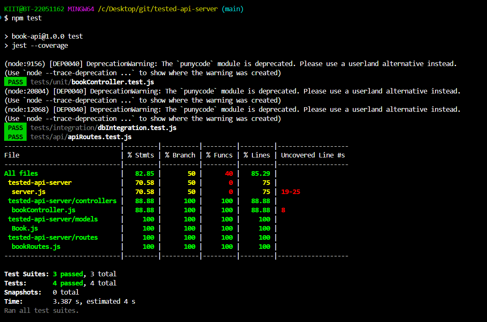

# 📚 Tested API Server with Full Test Coverage

Welcome to the **Tested API Server** — a simple and powerful REST API built with **Node.js**, **Express**, and **MongoDB**.  
This project demonstrates robust API design, modular architecture, and comprehensive automated testing.

---

## 🚀 Features

- **CRUD operations** for Book resources
- **Unit tested** controller logic with mocking
- **Integration tested** using in-memory MongoDB
- **API tested** with Supertest
- **Over 80% test coverage**
- Lightweight, modular, and maintainable codebase

---

## 🧠 Tech Stack

- **Backend:** Node.js, Express.js  
- **Database:** MongoDB, Mongoose  
- **Testing:**
  - Jest (Unit & Integration Test Framework)
  - Supertest (API Endpoint Testing)
  - mongodb-memory-server (Mock In-Memory MongoDB for tests)

---

## 🗂️ Project Structure

├── server.js                     # Express setup & MongoDB connection
├── models/
│   └── Book.js                   # Mongoose Book model
├── controllers/
│   └── bookController.js         # Controller with create & get logic
├── routes/
│   └── bookRoutes.js             # API route handlers
├── tests/
│   ├── unit/                     # Unit tests (mocked DB)
│   │   └── bookController.test.js
│   ├── integration/              # DB integration test
│   │   └── dbIntegration.test.js
│   └── api/                      # Full API test with Supertest
│       └── apiRoutes.test.js
├── coverage.png                  # Test coverage screenshot
├── package.json
└── README.md                     # You're reading it!

---

## 🧪 Test Coverage

- **Unit tests:** Validate controller logic with mocks
- **Integration tests:** Validate DB interactions with in-memory MongoDB
- **API tests:** Validate REST endpoints using Supertest
- **Coverage:** Over 80% lines tested

**Test Result Example:**  


---

## 📦 Installation & Setup

1. **Clone the repo**

   ```git clone https://github.com/hritika2409/tested-api-server.git```

   ```cd tested-api-server```

2. **Install dependencies**

   ```npm install```

4. **Run tests**

   ```npm test```


---

## 📝 Usage

- **Start the server:** `npm start`
- **Run all tests:** `npm test`
- **View coverage report:** `npm run test -- --coverage` and open the HTML report in `coverage/lcov-report/index.html`

---

**Happy Coding!**
